# Refactor Phase

## Overview of the Refactor phase

In the *Refactor* phase, the COBOL application developer uses the *Refactoring Assistant* VS Code extension to extract parts of the COBOL application into a modular business service.  In the typical workflow the application architect has identified the functionality to refactor and has communicated this to the COBOL application developer.   In this lab the functionality within the *GenApp* application that calculates a customer's average motor vehicle insurance policy premiums has been selected.

## Start the Refactoring Assistant

*Refactoring Assistant* is delivered as an Open Container Initiative (OCI) image that runs as a container in a Linux Virtual Machine (VM).  Your lab environment provides this Linux VM but you need to start the Refactoring Assistant within the VM by following the instructions in this section.

1. Open *PuTTY* from the taskbar by clicking on the icon highlighted in the screen snippet below:

    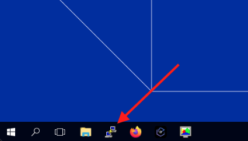

2. In the list of PuTTY's *Saved Sessions*, select *wca4z-ra* and click *Open*.

    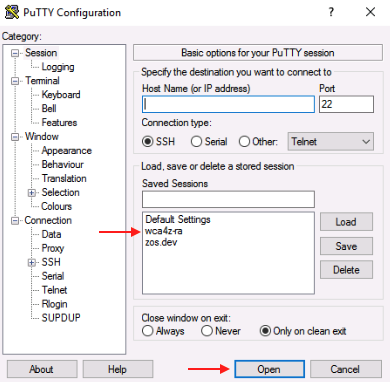

3. After clicking *Open*, you will receive a security warning. Select *Accept*.

    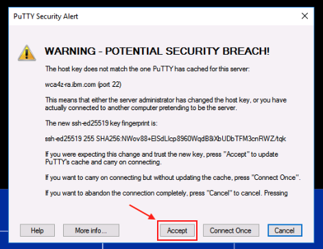

    This warning should only appear the first time you load the *wca4z-ra* session.
    
    Scripts will automatically run in the PuTTY session to configure and start the Refactoring Assistant.  In addition, a GitLab server will be started that will be used later in the *Transform* phase.  

4. Once you receive the message `IBM watsonx Code Assistant for Z Refactoring Assistant started` in the PuTTY console, you can close PuTTY.

    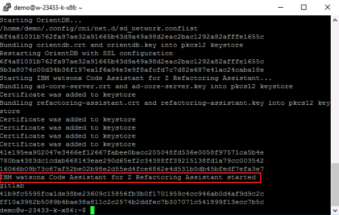

## Refactor your COBOL Programs using Refactoring Assistant

The *Refactor* phase and the remaining phases in the lab (*Transform* and *Validate*) use VS Code.

3. Before you start VS Code, let's get an API key that you will need to enter within VS Code that will grant you access to the *watsonx Code Assistant for Z* service that runs in IBM Cloud. In your lab environment that API Key is stored in a file on the Windows Desktop.  Open the text file named *wca4z-key.txt* on the Windows Desktop. 
   
    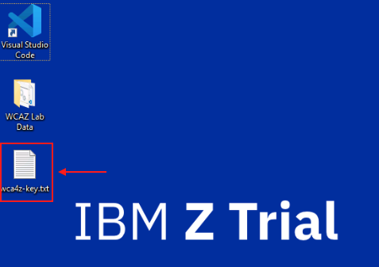

4.  Select the entire API key in the text file and use *Ctrl-C* to copy it to the clipboard.
    
    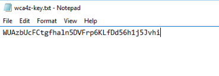

1.  Open *Visual Studio Code* (VS Code) by double-clicking its desktop shortcut.

    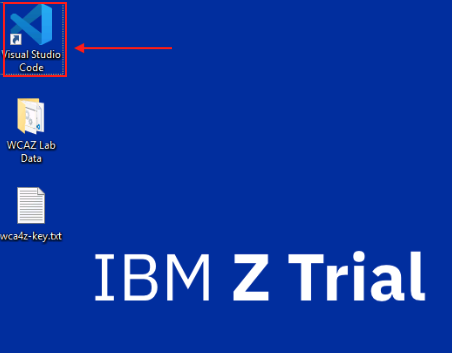

2.  At the bottom Explorer pane on the left, expand the *IBM WATSONX CODE ASSISTANT FOR Z* section if it is not already expanded.

    You should see a prompt to *Enter API key*.

    

5.  Click the *Enter API key* prompt. An input bar will appear in the top-middle of the page. Use *Ctrl-V* to paste the API key that you just copied from the text file and press *Enter*.

    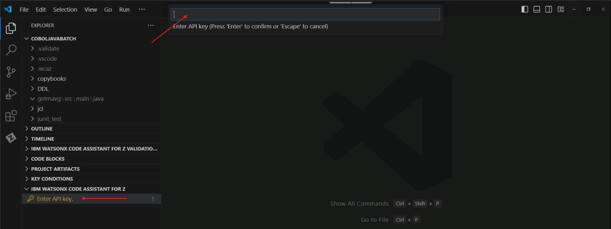

    If this was successful, the *Enter API key* prompt should disappear and you should see a message popup in the lower right that says *Connected to watsonx Code Assistant for Z*.

6.  Click the user icon in the bottom-left corner of VS Code, and select the option to *Sign in with IBM ADDI to use IBM watsonx Code Assistant for Z Refactoring Assistant (1)*.

    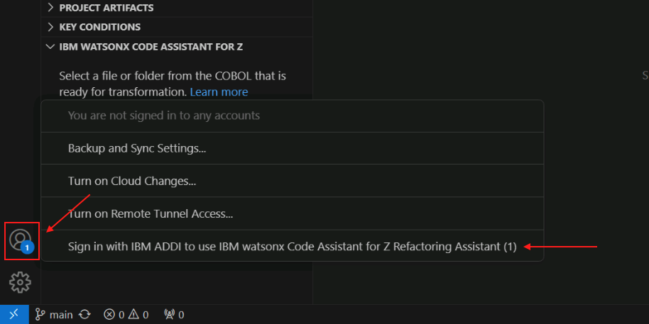

    A new tab will open in VS Code with a login prompt.

7.  Log in with the following credentials:

    - Email address: `dev@wca4z-ra.ibm.com`
    - Password: `password`

    

    After logging in, a new input field will appear in the top-middle of VS Code to select a project.

    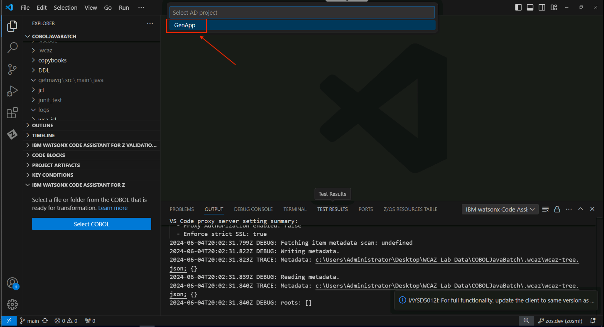

8.  Select the *GenApp* option in this new field.

    Another new page will open with an option to search for artifacts within the GenApp project. 

9.  Click the search bar, click the dropdown that currently says *All artifact types*, and select *Programs*.

    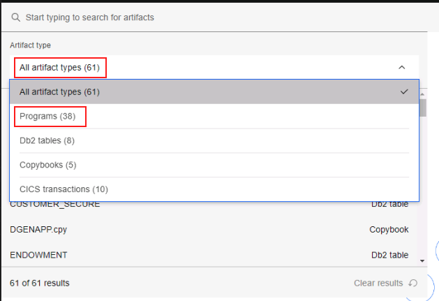

10. From the list of Programs, select *GETAAVG* and press enter.

    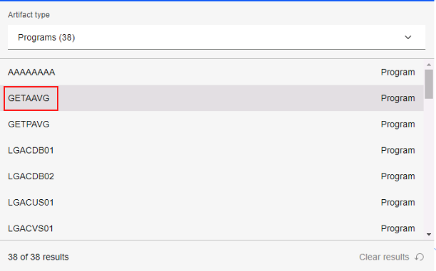

    A graph showing the dependencies for the *GETAAVG* program will appear.

    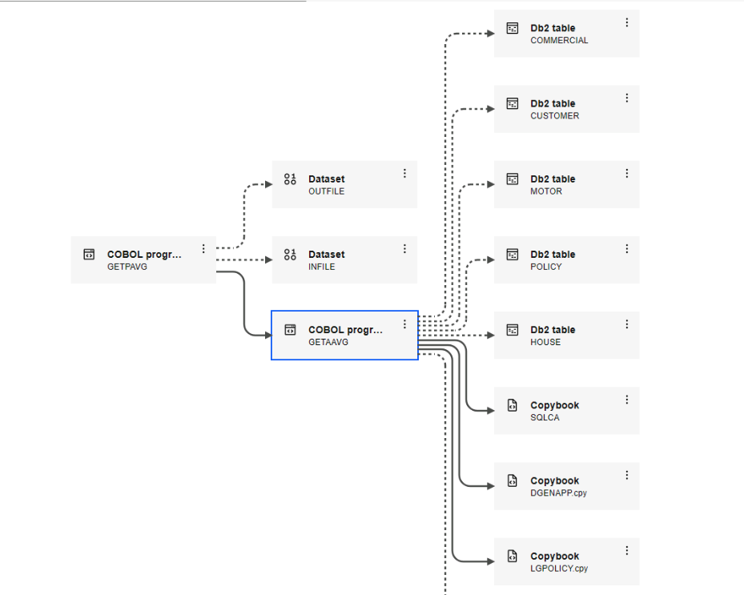

11. Click the *GETAAVG* program to get a new panel with the program's details, and incoming and outgoing references.

    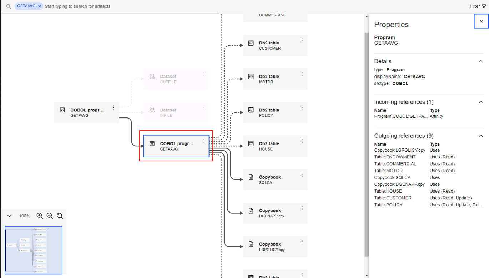

12. Click on the 3 dots associated with the *GETAAVG* program and select the *Identify conditional statements* option.

    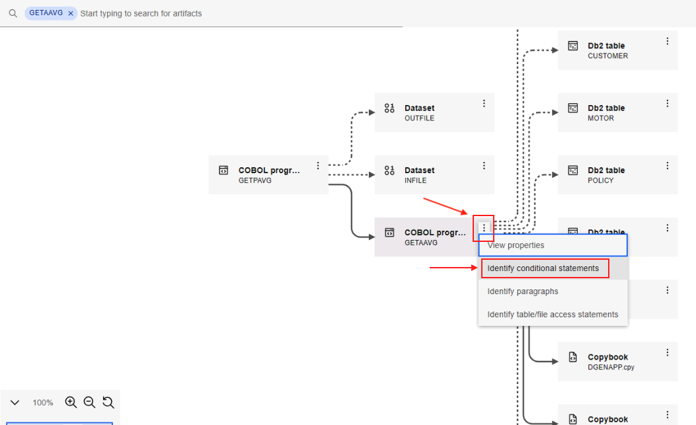

    This will open the COBOL code for the *GETAAVG* program in VS Code and it will list all of the conditional statements in the code in the bottom left *Key Conditions* section.

    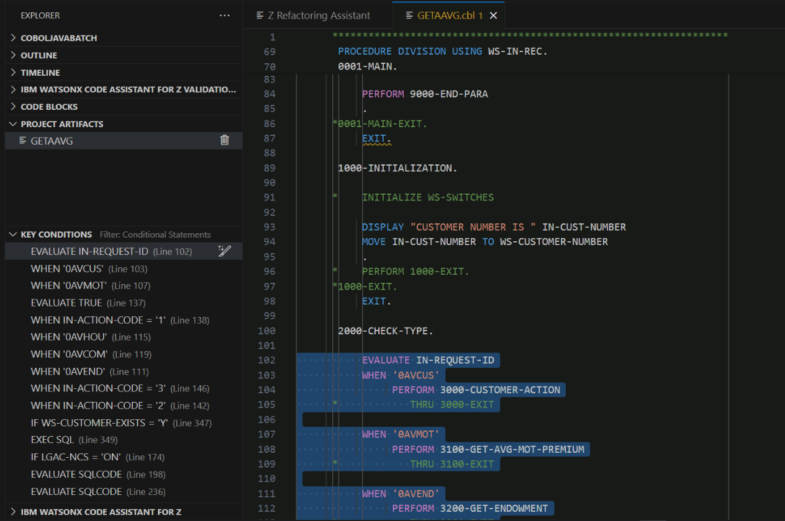

13. Select the *WHEN '0AVMOT'* statement under *KEY CONDITIONS* to jump to the conditional statement in the *GETAAVG* program code. This is the condition that, when true, calls the functionality that we wish to refactor.

    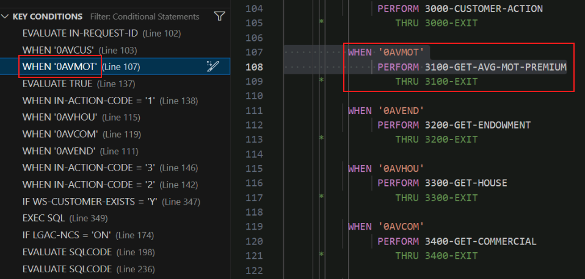

14. In the *KEY CONDITIONS* section, right-click the *WHEN '0AVMOT'* statement and select the option *Slice on condition to new service*.

    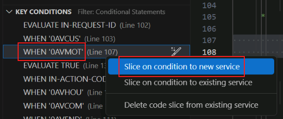

15. A new input field will appear in the top middle of VS Code with a prompt to *Enter service name*.
16. Provide a service name of `refactor` and press enter.

    **Important**: This environment is configured such that you must provide the name `refactor` in this step, exactly as shown.  The reason for this is that a Jenkins pipeline that is triggered when you do a Git commit later expects to find artifacts in a folder of the name `refactor`, and what you enter in this step will be the name of the folder in which these artifacts are stored.

    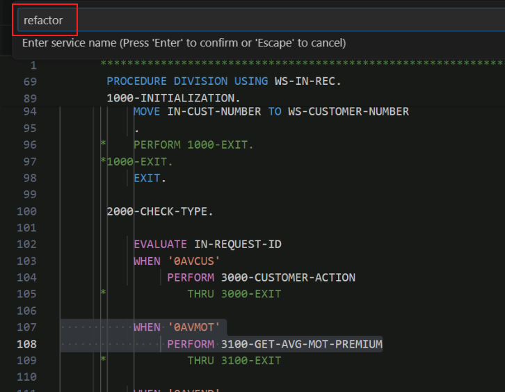

17. The code will be sliced into new service named *refactor* and will open in a new tab on right side of VS Code.

    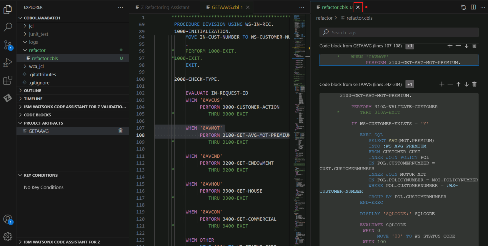

    This tab shows the code from the *WHEN* clause that you initially chose, the COBOL paragraph called from that *WHEN* clause (*3100-GET-AVG-MOT-PREMIUM*),  and then it shows COBOL code from paragraphs called from *3100-GET-AVG-MOT-PREMIUM*, and so on.  These various code snippets are presented to you in VS Code from information within the *refactor.cbls* file.  *refactor.cbls* is actually a JSON file, so while you're being shown COBOL source code, this file isn't in a format that can be compiled by the COBOL compiler.  The next step will take care of that.   You can close this *refactor.cbls* tab in order to reduce clutter in the VS Code window.

18. In the left side menu of VS Code under the *refactor* folder, find *refactor.cbls*. Right-click *refactor.cbls*, hover over the option for *Z Refactoring Assistant* and select *Generate Service Code*.

    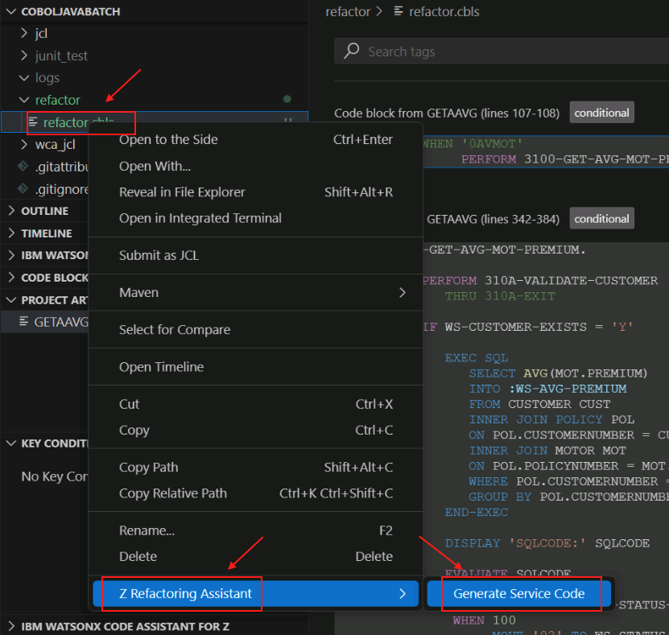

20. A new input field will appear in the top middle of VS Code prompting you to *Enter a service program name*. 

21. In this field, type `GETMAVG` and press *Enter*. 

    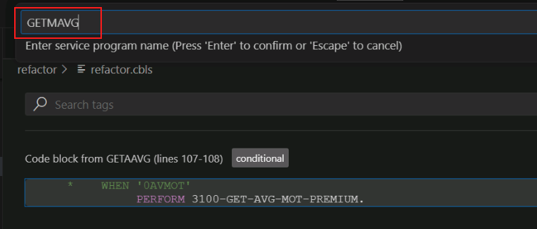

    A new tab will open with the refactored code, *GETMAVG.cbl*.

    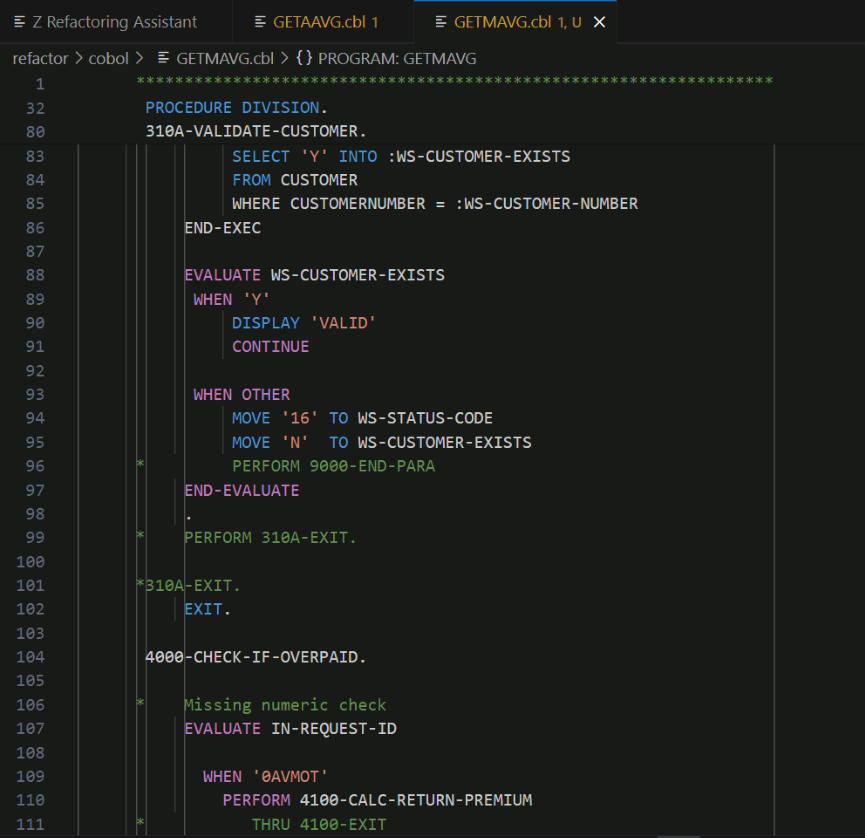

    If it does not automatically open, double click *GETMAVG.cbl* from the left-side menu to open it.

    What you have just done is you have created a COBOL source file, *GETMAVG.cbl*, with the refactored code, based on the contents of the *refactor.cbls* file.  *refactor.cbls* is actually a file in the JSON format which, while containing COBOL source code within it, also contains other control information in the JSON format.  When you *sliced* the code into a service, this control file *refactor.cbls* was created for you, and when you choose *Generate service code* against this control file, that is when the file containing COBOL source code, *GETMAVG.cbl*, was created.

    Notice that we instructed you to use the name *GETMAVG* for the generated code.  This is because we are refactoring out the motor vehicle policy-related code from a larger program that dealt with multiple policy types.   The *M* in *GETMAVG* stands for motor vehicle.  Think of the first *A* in *GETAAVG* as standing for *all*.  

## Modify the refactored service code

It is important to keep in mind that Refactoring Assistant is an *assistant* and that it may still be necessary to make some modifications to the refactored COBOL code.  These modifications might be necessary for several reasons, including

- To adhere to company coding standards

- To fix problems that prevent the refactored COBOL code from compiling correctly

- To remediate quirks in the refactored COBOL code that may be considered program defects and are likely to be fixed in future updates

In this section we'll make several changes to the refactored code and give a rationale for why these changes are being made.

1. In VS Code, make the following changes to the `GETMAVG.cbl` file:

    - Comment out the following line as shown below by adding an asterisk in column 7 (it's a COBOL thing)
        
        `COPY SQLCA.`

        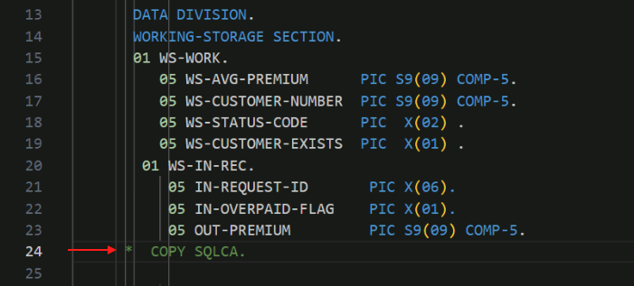

    **Q. Why did you make me do this?** 

    **A.** This appears to be a quirk in Refactoring Assistant.  The original source program did not have a *COPY SQLCA.* statement in it, but Refactoring Assistant added it.   This seems unnecessary because the lines right below that include SQLCA as part of the *EXEC SQL* statement perform the same purpose.

    - Add the following 3 lines after `END-EXEC.` of `INCLUDE SQLCA`

        ```
        EXEC SQL
          INCLUDE DGENAPP
        END-EXEC.
        ```

        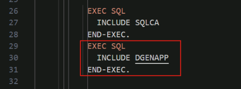

    **Q. Why did you make me do this?** 

    **A.** This appears to be a quirk in Refactoring Assistant.  The original source program contained these lines, but Refactoring Assistant did not bring it along in its generated COBOL code. This include is necessary because it contains information about the SQL tables used that is necessary to be in the metadata information needed for Java transformation.  If you leave this line out then the data model classes will not be generated properly.

    - Add a new line after statement `PROCEDURE DIVISION` and add `1000-MAIN-PARA.` on the newly inserted line.

        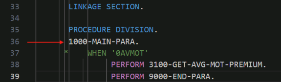

    **Q. Why did you make me do this?** 

    **A.** This change may be considered a change to adhere to a corporate standard- perhaps the company's coding standard is that all paragraphs should be explicitly named, so the first paragraph in the *PROCEDURE DIVISION* is given an explict name.

    - After `PERFORM 3100-GET-AVG-MOT-PREMIUM` add the following lines, making sure to place them in the same column as in the image below.
        
        `PERFORM 9000-END-PARA.`

        `1000-EXIT.`

        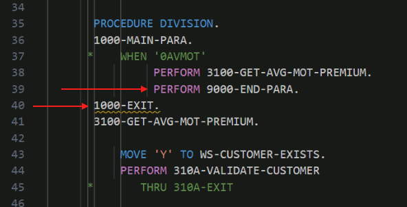

    **Q. Why did you make me do this?** 

    **A.** The addition of *PERFORM 9000-END-PARA.* in this case is an example of a personal choice by the COBOL developer.   *9000-END-PARA* is a simple paragraph that displays a status code. This paragraph is called from other paragraphs in the new COBOL service, but maybe the COBOL developer chose to call the paragraph from this particular spot in the code.  The addition of *1000-EXIT.* may reflect a company coding convention- there are esoteric reasons why such an empty paragraph may be required by corporate coding standards. 

    - After `3100-GET-AVG-MOT-PREMIUM` add the following line.
        
        `MOVE 'Y' TO WS-CUSTOMER-EXISTS.`

        

    **Q. Why did you make me do this?** 

    **A.** The developer may have preferred to initialize this variable prior to calling the subroutine.

    - Comment out the `GOBACK.` statement at the end of the code.
  
      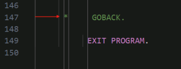

     **Q. Why did you make me do this?** 

    **A.** Refactoring Assistant added an *EXIT PROGRAM* statement to the end of the generated service code, so the *GOBACK* statement is no longer necessary and can be removed.

In the *Refactor* phase, 

1. We used knowledge about our sample application, GenApp, from the *Understand* phase to select the *GETAAVG* COBOL program.
2. We used IBM watsonx Code Assistant for Z Refactoring Assistant to refactor the *0AVMOT* conditional statement by slicing the conditional statement into service code.
3. We made some minor modifications to the COBOL service code that was generated to help make the point that the Refactoring Assistant is just that, an *assistant*, and that it is expected that the COBOL developer may have the need or desire to make modifications.
4. This service code will be used in the following *Transform* phase.
