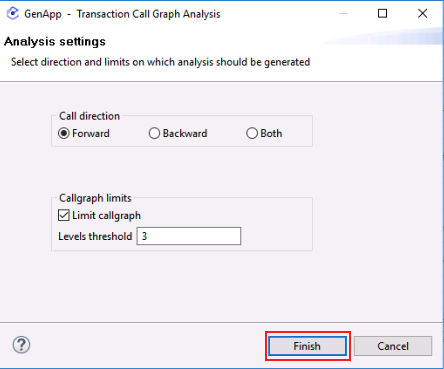

# Understand Phase

## Overview of the Understand phase

During the *Understand* phase an application architect uses *Application Discovery and Delivery Intelligence (ADDI)* to analyze an application, primarily through its source code, but also often through other artifacts.  The analysis performed by ADDI is stored in an *ADDI Project*, using a relational database schema.  The application architect uses the *ADDI Analyze Client* to create and view charts, graphs and reports in order to help gain a better understanding of the application and identify candidates for refactoring.

**Note:** Even if an enterprise already has a perfect understanding of their COBOL application, the *Understand* phase is a prerequisite for the *Refactor* phase, because the components used in the *Refactoring* phase read an ADDI project's database.

**Note:** ADDI is a powerful product, with a large number of features and reports.  This lab only scratches the surface of what can be done in ADDI with a realistic application. The *Understand* phase is a critical part of the *watsonx Code Assistant for Z* workflow, the importance of which is likely understated by the ADDI-related lab instructions- in real-world usage scenarios it is to your benefit to give proper weight to the *Understand* phase.

## Initial login to the lab environment

1. Log in to your IBM Z Virtual Access (zVA) environment.  Your lab environment is a Windows system that you will access via your web browser.
    
    Your [access details for your environment are on this page](../lab-assignments.md){target="_blank" rel="noopener"}. If you are not sure how to access your environment, please ask your lab instructor for help.

    The picture below shows what your browser tab or window should look like after you have successfully logged in to your zVA environment.

    

    **Note:** All lab instructions, unless explictly noted, are performed within your browser tab or window in which your zVA Windows environment is displayed. 

## Introducing GenApp
In this lab, you will be using the general insurance application, **GenApp**. GenApp is a sample CICS COBOL application that provides transactions that *could be* used by an insurance company to create and manage its customers and insurance policies.  *Could be* was italicized in the previous sentence as GenApp is provided primarily for educational and testing purposes- if you are an actual insurance company it is likely that market forces would encourage you to use transactions that are slightly more sophisticated than the ones in GenApp.

You can read more about GenApp [here](https://www.ibm.com/docs/en/cics-ts/6.1?topic=samples-general-insurance-application){target="_blank" rel="noopener"} and its architecture [here](https://www.ibm.com/docs/en/cics-ts/6.1?topic=application-architecture){target="_blank" rel="noopener"}.

## Explore the application using ADDI and IBM Developer for z/OS

6. Open [*IBM Developer for z/OS (IDz)*](https://www.ibm.com/products/developer-for-zos){target="_blank" rel="noopener"} from the taskbar. IDz is built on the open source Eclipse project.  The *ADDI Analyze Client* functionality is delivered via Eclipse-based plugins, so the application architect performs analysis within IDz using functionality provided by these plugins. 

    

7. After a short while you will probably see a "splash screen" for *IBM Developer for z/OS*. Then it will disappear and you may be prompted with the *Select a directory as workspace* popup window. If you receive this, leave the default workspace path unchanged and click *Launch*.

    The correct workspace path should be: 

    ```
    C:\Users\Administrator\.zosexplorer
    ```

    

    The launcher window will close, the splash screen may return for a moment, then disappear, and finally the *Application Discovery Browser* perspective provided by ADDI will be opened up within IDz.

    **IDz can take a few minutes to fully load in your lab environment. After clicking *Launch*, the popup window will close and it may look like the application is not opening. Please be patient- wait at least three minutes before you wake up the instructors.**


8. Once you see the *Explore projects* tab, right-click on the empty list of projects and click *Get Project List*.

    

    The GenApp project will appear.

    

9. Click the GenApp project to highlight it. This will bring up a new pane on the right side of the page that shows the many charts, graphs and reports that are provided by ADDI.  Information about these reports can be found in the [ADDI documentation](https://www.ibm.com/docs/en/addi/6.1.2?topic=guide-analyzing-applications-ad-analyze){target="_blank" rel="noopener"}.  

    Double-click *Program Callgraph* in the new pane.

    

10. A new window will appear where you can select which programs to analyze. It may take a moment for the program names to appear in the *Available programs* pane within the window. Once they do, click the double arrow button to move all of the programs from *Available programs* to *Selected programs*, then click *Finish*.  

    

    Please be patient. This can take a minute or two to fully load.

    When loaded, you will see a call graph for all programs, CICS transactions, tables, and other files in the GenApp application and the interdependencies between them.

    

    This is an interactive chart. You can zoom in and scroll around the graph to see different objects. One way to zoom in is to click the *Interactive Zoom Tool* icon in the toolbar at the upper right of the chart.  Hover over the icons until you find the *Interactive Zoom Tool*.  Then click on the chart and very slowly drag your cursor in order to zoom in on the chart.  You can also right-click the objects to see more specific details about them.

    **Note:** Trying to zoom in and out on the graph in the zVA browser tab or window can be difficult- it is easy to get in a state where you wish you could start over.  You can- just close the graph by clicking the *x* icon on its tab and then repeat step 4 and this step.

11. In the left-side of the page, you will see a Graph Inventory. Notice that the CICS transactions, COBOL Programs, and different object types have been identified. Expand the *COBOL Programs* section to see the list of COBOL programs that are part of GenApp.

    

12. In the *Graph Inventory*, right-click the `GETPAVG` program, hover over *Mainframe Graphs*, and select *Program Callgraph*.

    

14. Leave the default options unchanged and click *Finish*.

    

    A new callgraph will be generated that is scoped to only the objects in the application flow that are used by the *GETPAVG* program or by other programs that are called by *GETPAVG*.

    

    Two COBOL programs should be displayed in the callgraph: 

    1. The main program *GETPAVG*. This program accesses the input and output files.
    2. A called program named *GETAAVG*. This program accesses various SQL tables shown at the bottom of the callgraph.

15. Double-click on the COBOL program named *GETAAVG* to open a new panel at the bottom with the COBOL source code of *GETAAVG*. Maximize the source code by clicking the button in the top-right of the panel.

    

    The COBOL program *GETAAVG* should now be maximized.

    

    If you look through the *GETAAVG* source code, you will find that in the *2000-CHECK-TYPE* paragraph it will perform different operations depending on the request ID (*IN-REQUEST-ID* data item) passed in to *GETAAVG* via its *LINKAGE SECTION*:

    1. Customer Action (`0AVCUS`)
    2. **Get Average Premium** (`0AVMOT`)
    3. Get Endowment (`0AVEND`)
    4. Get House (`0AVHO`)
    5. Get Commercial (`0AVCOM`)

    For the purposes of this lab, let's assume that the application architect has identified the paragraph that implements the *Get Average Premium* functionality as a good candidate for refactoring.  (This is why we've highlighted *Get Average Premium* in the above list.)

16. Scroll down to line 342 in the COBOL code until you find the *3100-GET-AVG-MOT-PREMIUM* paragraph. 

    

    **Hint:** You can check the line you're on using the first number pointed out in the image above- this shows the location of the current cursor position so you may need to click inside the source code after you've scrolled.

    The *3100-GET-AVG-MOT-PREMIUM* paragraph is one small part of the overall GenApp sample application. It is called when the request ID is *0AVMOT*.

    This paragraph calculates the average premiums for a customer's motor vehicle insurance policies.  The application architect decides that this would be a good service to refactor into a modular business service.

    In the next section of the lab, you will refactor this paragraph into a separate COBOL service, and then in the section after that, you will transform this service into Java code.

    You will not be using IDz anymore in the lab instructions so you may either minimize it or exit from it altogether.

In the *Understand* phase,

1. We selected the *GETPAVG* program to understand its flow and related components.
2. We explored the called program *GETAAVG* and its *3100-GET-AVG-MOT-PREMIUM* paragraph and decided that the functionality in this paragraph is a good candidate for refactoring into a modular COBOL service and for then transforming into Java code.
