# Validate Phase

## Overview of Validate Phase

The purpose of the Validate phase is to ensure the semantic equivalence of the refactored COBOL code with the generated (and possibly modified) Java code.

The general flow is this:

- The COBOL developer compiles the refactored COBOL with the *TEST(DWARF)* compiler option which produces debugging information in the load module created by the compilation and link-editing.  
- The COBOL developer uses the *watsonx Code Assistant for Z Validation Assistant* VS Code extension to read the compiler listing, compile and run test cases using the IBM z/OS Debugger, and saves the output from these test cases.
- The Java developer uses the *watsonx Code Assistant for Z Validation Assistant* to run tests against the generated Java method which will compile and run Junit tests locally on the developer workstation and compare the output to the output of the corresponding COBOL test case.

In the lab you will perform all of these steps in one sitting.  In the real world scenario, the COBOL developer would likely run the COBOL portion of the process on their laptop or workstation and then provide the folder which has these results to the Java developer who would put this folder on their laptop or workstation prior to running the Java tests.

## Generate COBOL outputs

### Establish credentials in ZOWE Explorer

1. In VS Code, click the Zowe icon on the left side.

    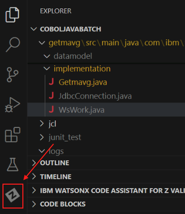

2. In the *JOBS* section near the lower left, right-click on the *zos.dev* profile and choose *Manage profile*:

    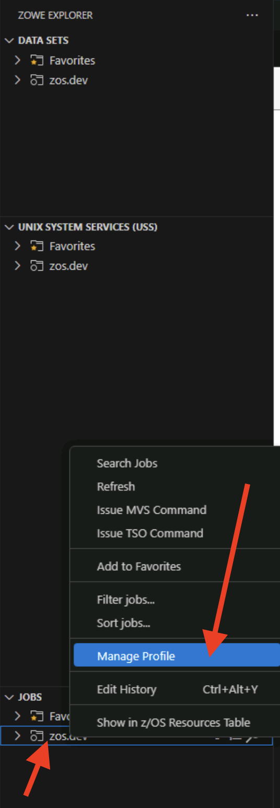

3. A menu will appear in the top middle of VS Code.  Click on *Add credentials*:

    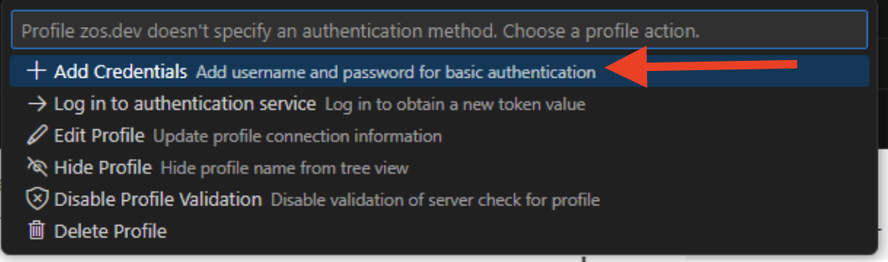

4. You will be prompted first for a username, and then for a password. Enter the following credentials.

    - Username: `ibmuser`
    - Password: `sys1`

2. In the *DATA SETS* section, expand the both the *Favorites* and *zos.dev* folders.

    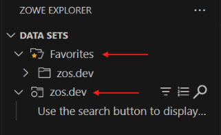

4. Click the search button next to the bottom *zos.dev* folder.

    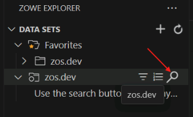

    You will need to hover over the *zos.dev* bar for the search icon to appear.

5. **Note:** You may be prompted first for a username, and then for a password. If not, proceed to the next step.  If you are, enter the following credentials.

    - Username: `ibmuser`
    - Password: `sys1`

6. You will be prompted to enter a dataset filter. Enter `ibmuser.wca4z.**` in the bar at the top of the page and press *Enter*.

    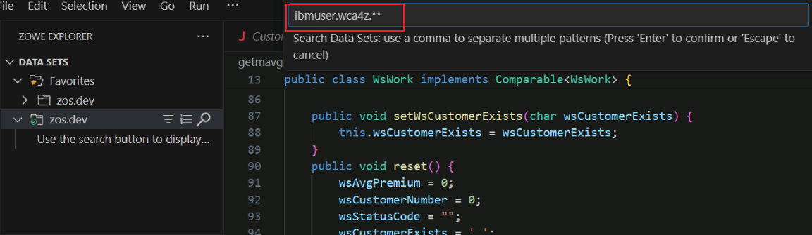

    Multiple data sets will appear in the *zos.dev* folder, including *IBMUSER.WCA4Z.COBOL*.

### Generate COBOL compiler listing

5. Back in the *DATA SETS* section of the ZOWE explorer pane, expand *Favorites* and then *zos.dev* underneath it, and then right-click on *IBMUSER.WCA4Z.COBOL* and select *Upload member*.

6. Browse to *C:\Users\Administrator\Desktop\WCAZ Lab Data\COBOLJavaBatch\refactor\cobol*, select *GETMAVG.cbl*, and click *Upload file*.

    You should now see the *GETMAVG* file under *IBMUSER.WCA4Z.COBOL*.

    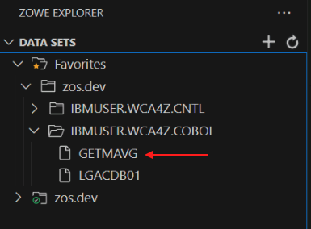

7. Expand the *IBMUSER.WCA4Z.CNTL* folder, right-click *GETMAVG*, and select *Submit Job*.

    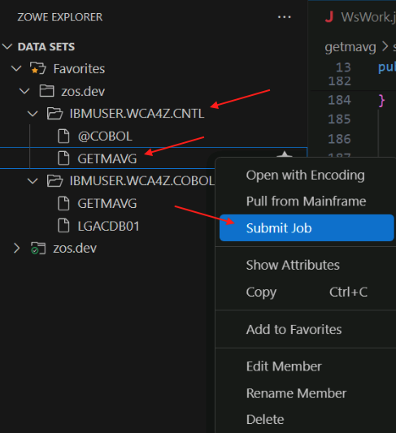

8. You will be prompted to confirm that you want to submit the job. Click the *Submit* button.

    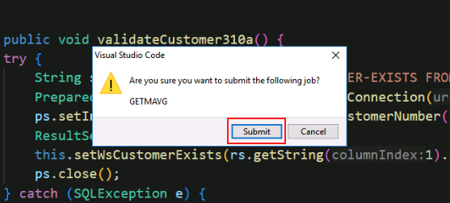

9.  After you submit the job, you will get a pop-up in the bottom-right corner with the Job ID. Click on the Job ID to go to it.

    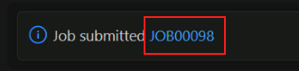

    Note: if the job notification disappears before you click on it, you can find it again by clicking the *Notifications* button in the bottom-left corner of VSCode.

    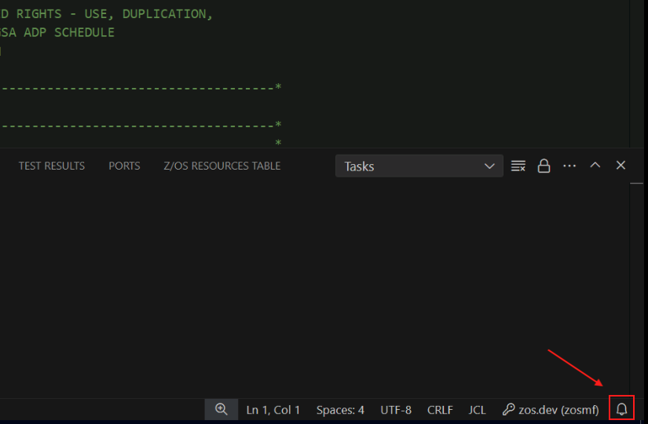

10. You should see a *CC 0004* next to the job name and number.  Any condition code higher than 4 should be investigated- ask for help from an instructor if necessary.  As long as your condition code is 4 or 0, right-click on the Job name and select *Download all*. 

    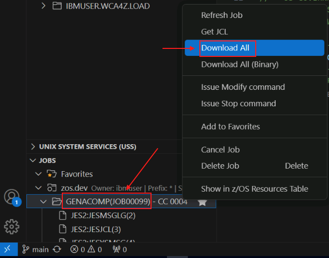

11. Navigate to *C:\Users\Administrator\Desktop\WCAZ Lab Data\COBOLJavaBatch\logs* and click *Select* to save the files.

    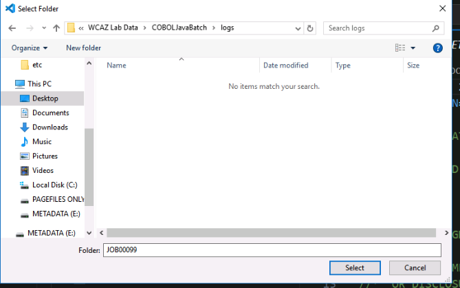

12. Navigate back to the file Explorer in VSCode and find the *logs* folder.

    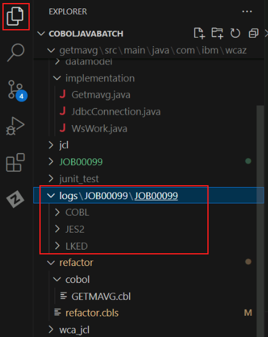

13. In the *COBOL/GETMAVG* folder, rename `sysprint.txt` to `getmavg.log`.

    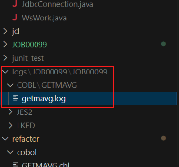

### Generate COBOL values 

14. Right-click *getmavg.log*, hover over *watsonx code assistant for Z Validation Assistant*, and then select *Generate cobol values for testing*.

    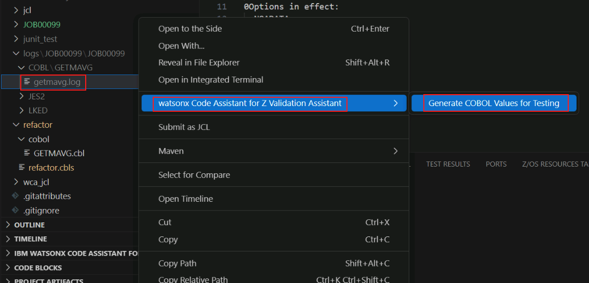

15. You will be prompted to select a *Load library*. Enter or select *IBMUSER.WCA4Z.LOAD* and press enter. 

    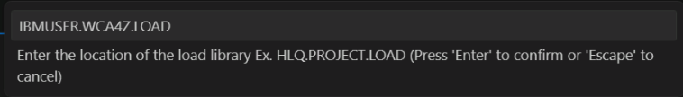

    This step was successful if you see the message *Completed generating cobol values for testing* at the bottom of your *Output* window.

    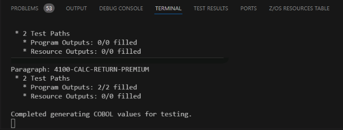

## Run Java equivalence tests

1. Expand the *IBM WATSONX CODE ASSISTANT FOR Z* section, expand *WsWork.java*, and click on *calcReturnPremium4100*.

    The code will display in the main window and the *calcReturnPremium4100* method will be highlighted.

2. Double-click the method name in the main window so that just the method name is highlighted. Then right-click the highlighted method name, hover over *watsonx Code Assistant for Z Validation Assistant* and select *Run Equivalence Test*.

    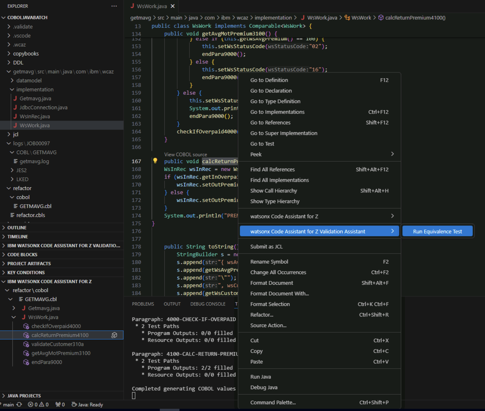

    Wait until you see the message *Equivalency Tests Complete*. 

    **Note:** You may see an error message popup in the lower right that says *Failed to perform operation: SyntaxError: Expected double-quoted property name in JSON at position 188 (line 4 column 5)*.  You may ignore this message- it is due to a syntax error in a settings file provided in the lab environment.
    
    In the *IBM WATSONX CODE ASSISTANT FOR Z VALIDATION ASSISTANT* pane, a green checkmark icon next to the test means the test passed and a red 'x' icon next to the test means that it failed.   Ask an instructor for help if your test didn't pass.

3. Repeat steps 1 and 2 for Java methods *checkIfOverpaid4000* and *MainPara1000*. 

<!--- TODO add screenshot of passed equivalency tests --->

In the *Validate* Phase, 

1. We generated COBOL values for the *GETMAVG* refactored service.
2. We ran JUnit tests to compare the values from the transformed Java code.

## Lab summary

Congratulations for completing the lab!  In this lab, you performed tasks for several personas:

1. You performed the *Understand* phase in the role of an application architect 
2. You performed the *Refactor* phase in the role of a COBOL application developer
3. You performed the *Transform* phase in the role of a Java application developer
4. You performed the *Validate* phase in the role of a Java application developer

